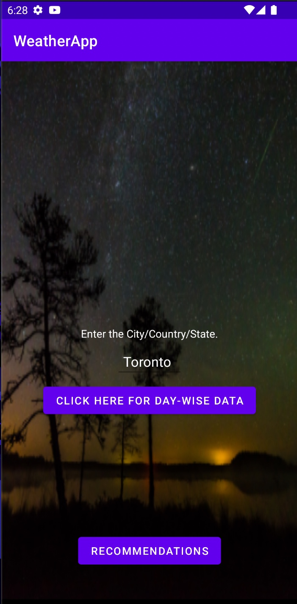
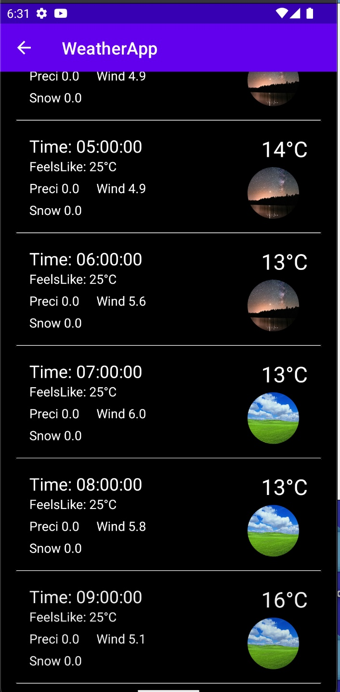
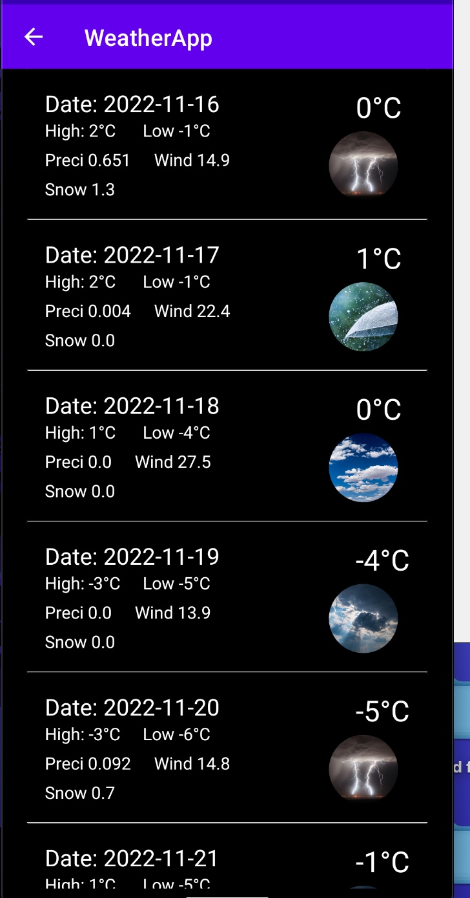
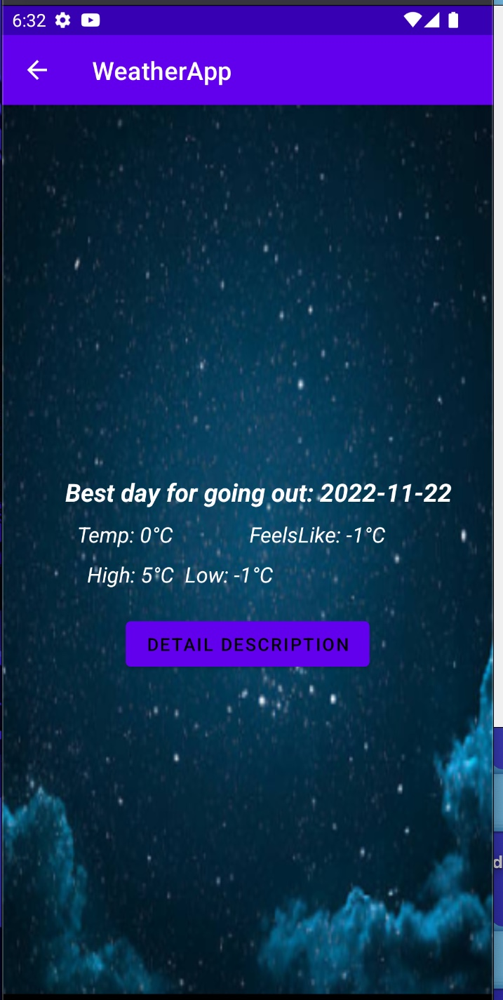
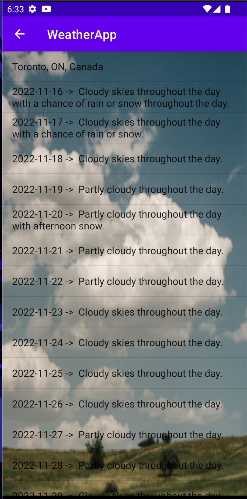

# Weather
1: WeatherApp is an online Android app that is used to fetch the data from the public API and present it with the help of recycler view.    
2: WeatherApp is making the use of Volley Library.                                                           
3: The main purpose of the Weather App is to help people to decide which day would be best fit for them to go for outing. Being living in a st John's,NL 
whenever, I decide to go for outing with my friends, I have to scroll over the weather data of entire week because for most of the days weather is quite unpleasant. So, to overcome this problem I have decided to
create this app.                           
4: A link to the google play store: https://play.google.com/store/apps/details?id=com.Weather.rvtest

  
   
  

  
   

